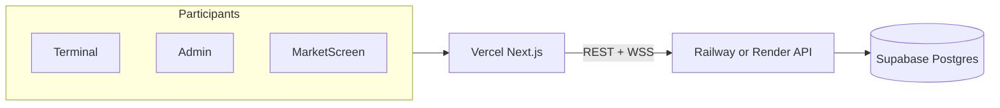

# TRADEVERSE — Cloud deployment

Single architecture for every participant: **one Supabase database**, **one API worker**, **one Vercel frontend**. All devices see identical prices, portfolios, and leaderboard because the server is authoritative.



## Components

| Layer | Service | Role |
|-------|---------|------|
| Frontend | **Vercel** | `/terminal`, `/admin`, `/market-screen` |
| Database | **Supabase** | PostgreSQL — all game state |
| API worker | **Railway** or **Render** | FastAPI, simulation engine, matching, WebSockets |

See also: [`supabase/README.md`](supabase/README.md), [`PRODUCTION_READINESS.md`](PRODUCTION_READINESS.md)

---

## 1. Supabase

1. Create a project at [supabase.com](https://supabase.com)
2. Copy the **direct** connection URI (port 5432)
3. Run migrations:

```bash
cd backend
export DATABASE_URL="postgresql://..."
pip install -r requirements.txt
alembic upgrade head
```

---

## 2. API worker (Railway)

1. New service → connect this repo → set **root directory** to `backend/`
2. Uses [`backend/railway.toml`](backend/railway.toml) automatically
3. Set environment variables:

| Variable | Example |
|----------|---------|
| `DATABASE_URL` | Supabase direct URI |
| `ENVIRONMENT` | `production` |
| `AUTO_INIT_DB` | `false` |
| `JWT_SECRET` | 32+ char secret |
| `ADMIN_SECRET` | admin password |
| `FRONTEND_URL` | `https://your-app.vercel.app` |
| `BACKEND_URL` | `https://your-api.up.railway.app` |
| `CORS_ORIGINS` | `https://your-app.vercel.app` |
| `SIMULATION_SPEED` | `1` (live) or `60` (rehearsal) |

4. Deploy — release command runs `alembic upgrade head`
5. **Exactly 1 replica**, **1 uvicorn worker** (required for simulation lock + order books)

### Render alternative

Use [`render.yaml`](render.yaml) at repo root or create a Docker web service from `backend/Dockerfile`.

---

## 3. Vercel (frontend)

1. Import repo at [vercel.com](https://vercel.com)
2. Set **Root Directory** to `frontend/`
3. Environment variables (Production + Preview):

| Variable | Value |
|----------|-------|
| `NEXT_PUBLIC_API_URL` | `https://your-api.up.railway.app` |
| `NEXT_PUBLIC_WS_URL` | `wss://your-api.up.railway.app` |
| `NEXT_PUBLIC_API_PREFIX` | `/api/v1` |

4. Deploy

[`frontend/vercel.json`](frontend/vercel.json) is included.

---

## 4. Pre-event checklist

1. API health: `GET https://your-api.up.railway.app/api/v1/health`
2. Open `https://your-app.vercel.app/admin` → login with `ADMIN_SECRET`
3. Press **RESET** → expect canonical 40-stock universe message
4. **Do not START** until the live event
5. Take Supabase backup (dashboard → Database → Backups)

---

## 5. Load test

```bash
pip install httpx websockets
python backend/scripts/load_test_50_users.py \
  --base-url https://your-api.up.railway.app \
  --users 50
```

### Post-deploy sync smoke test

After deploy, verify multi-trader price and leaderboard consistency:

```bash
pip install httpx websockets
export ADMIN_SECRET=your-admin-secret   # optional — starts simulation if stopped
python backend/scripts/smoke_test_sync.py \
  --base-url https://your-api.up.railway.app
```

Checks: health, 3-trader join, identical LTP before/after a trade, leaderboard parity, WebSocket delivery.

---

## 6. Local development (optional)

Not used for production events. For hacking on the codebase only:

```bash
# Terminal 1 — API (SQLite or local Postgres)
cd backend
cp ../.env.example .env   # set DATABASE_URL=sqlite+pysqlite:///./mse_dev.db for quick start
pip install -r requirements.txt
uvicorn app.main:app --reload --port 8000

# Terminal 2 — frontend
cd frontend
cp .env.local.example .env.local
npm install && npm run dev
```

Open http://localhost:3000/terminal

---

## Synchronized state

| Feature | Authority | Live sync |
|---------|-----------|-----------|
| Prices | `stocks.last_traded_price` via settlement | WebSocket `PRICE_UPDATED` |
| Trades | `order_service` + matching engine | `TRADE_EXECUTED`, `WALLET_UPDATED` |
| Portfolio | `traders` + `holdings` | `/session/bootstrap`, WS |
| Leaderboard | `leaderboard_service` | `LEADERBOARD_UPDATE` |
| Simulation | `simulation_state` | `SIMULATION_CLOCK` |

All clients must use the **same** `NEXT_PUBLIC_API_URL` — never compute prices client-side.
